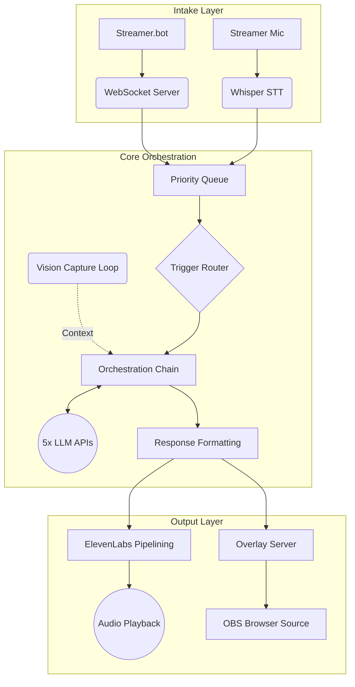

<div align="center">

# 🗡️ The Party Orchestrator
**A Multi-LLM Twitch Overlay System**

[](https://www.python.org/downloads/release/python-3100/)
[](https://obsproject.com/)
[](https://streamer.bot/)
[](https://twitch.tv/)
[](https://elevenlabs.io/)
[](https://opensource.org/licenses/MIT)

*Built by Moonie ([WatchMoonie](https://twitch.tv/watchmoonie))*

</div>

<br>

## The System

**The Party** is an AI co-presence system designed for live Twitch streams. It provides an ensemble of five distinct AI companions that react to stream events. 

Each character is powered by a different Large Language Model, integrating Anthropic, OpenAI, DeepSeek, Google, and xAI via a synchronized conversational pipeline. They process stream events, streamer speech, and game visuals to dynamically interact with each other and the audience through on-stream dialogue boxes.

## Core Features

* **Five-Model Ensemble Orchestration**: Routes responses through a cast of models (Claude Sonnet, GPT-4o, Gemini 2.5 Flash, DeepSeek, and Grok).
* **Live Screen Reading**: Uses GPT-4o Vision in an asynchronous loop to capture bursts of gameplay frames and maintain a context description of broadcast visuals.
* **Real-Time Voice Interception**: Translates streamer speech and routes triggers through a rules engine to determine the active speaker.
* **Concurrent TTS Pipelining**: ElevenLabs voice generation occurs in background worker threads. The system synthesises the audio of the following response while the current audio is playing, minimizing inter-response latency.
* **Context Loading Efficiency**: Utilizes a static snapshot architecture. Historical game data and vision logs are compiled into the System Prompt instead of message loops, lowering context token consumption over long sessions.
* **Visual Overlay**: Displays an OBS Browser Source overlay with an auto-scrolling typewriter text format, aligned statically across the character portraits.

## Architecture

The orchestrator operates purely locally. It acts as a command server that **Streamer.bot** connects to via WebSockets, whilst simultaneously hosting a secondary WebSocket endpoint that the **OBS Browser Source** connects to for live visual updates.



## Quick Setup

1. **Clone & Install**
   ```bash
   git clone https://github.com/Moonie8t7/The_Party.git
   cd The_Party
   pip install -r requirements.txt
   ```

2. **Environment Variables**
   Copy `.env.example` to `.env` and fill out your API credentials (OpenAI, Anthropic, Gemini, Deepseek, Grok, ElevenLabs, Twitch, IGDB).

3. **OBS Configuration**
   Import `overlay/overlay.html` as a Browser Source in OBS (1920x1080).
   Ensure OBS WebSockets are enabled on port `4455`.

4. **Launch**
   ```bash
   python -m party.main
   ```

<br>
*© 2026 WatchMoonie. Built for Twitch interactive streaming.*
