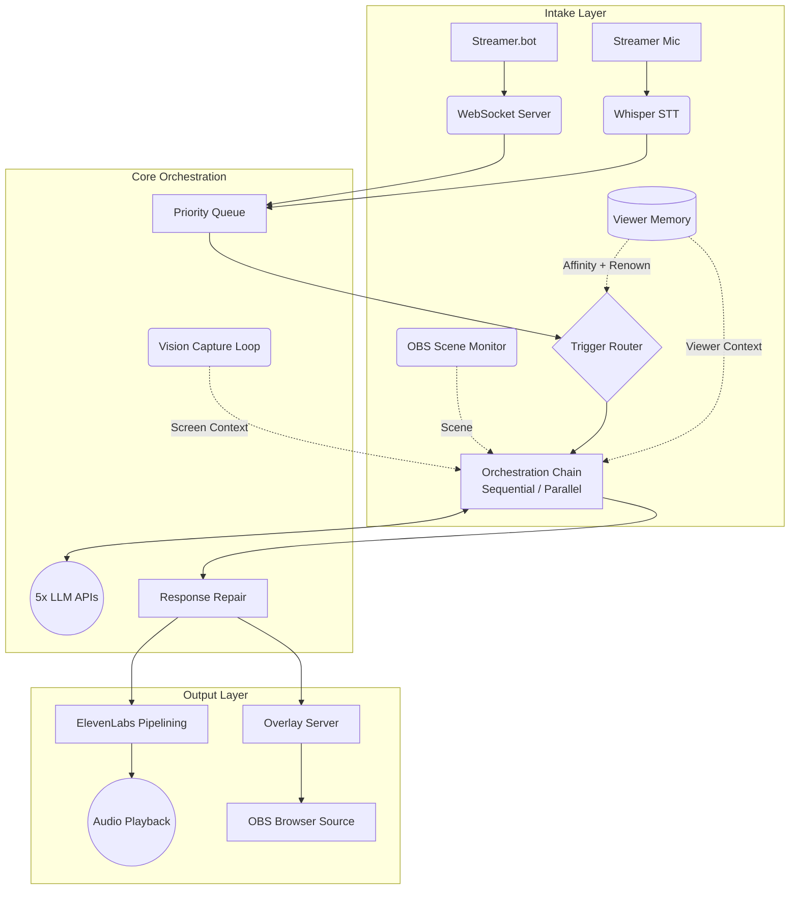

<div align="center">

# 🗡️ The Party Orchestrator
**A Multi-LLM Twitch Overlay System**

[](https://www.python.org/downloads/release/python-3100/)
[](https://obsproject.com/)
[](https://streamer.bot/)
[](https://twitch.tv/)
[](https://elevenlabs.io/)
[](https://opensource.org/licenses/MIT)

*Built by Moonie ([WatchMoonie](https://twitch.tv/watchmoonie))*

</div>

<br>

## The System

**The Party** is an AI co-presence system designed for live Twitch streams. It provides an ensemble of five distinct AI companions that react to stream events. 

Each character is powered by a different Large Language Model, integrating Anthropic, OpenAI, DeepSeek, Google, and xAI via a synchronized conversational pipeline. They process stream events, streamer speech, and game visuals to dynamically interact with each other and the audience through on-stream dialogue boxes.

## Core Features

* **Five-Model Ensemble Orchestration**: Routes responses through five distinct characters, each backed by a different LLM — Claude Sonnet, GPT-4o, Gemini 2.5 Flash, Grok-3, and DeepSeek Chat.
* **Live Screen Reading**: GPT-4o Vision captures bursts of five gameplay frames every 60 seconds and maintains a running narrative of what is on screen, injected as context on every trigger.
* **Hardened Voice Triggers**: A custom phonetic and fuzzy-matching engine intercepts streamer speech via Whisper STT and routes triggers with high precision, filtering out ambient noise and non-reactive phrases.
* **Lead + Companion Architecture**: Each trigger selects one Lead character and up to one Companion. The Companion always runs sequentially — it receives the Lead's response before generating its own, so it reacts to what was actually said rather than the same prompt independently. Full-party SYSTEM events (raids, subs, milestones) run in parallel across all five characters. A 3-second latency budget ensures companions are dropped cleanly rather than causing delays.
* **Per-Viewer Character Affinity**: Viewers accumulate affinity with specific characters through repeated interactions (d20 rolls, chat events). Affinity blends with base personality weights at selection time, biasing — but never overriding — which character responds to that viewer's moments.
* **Viewer Memory and Renown**: A persistent memory store tracks each viewer's history — chatter milestones, subscription loyalty, raids, gifted subs, and d20 fate. A Renown score aggregates this into a narrative tier label (newcomer → legend) injected into character context when that viewer appears.
* **Autonomous Idle Interaction**: A background coordinator monitors stream activity and triggers in-character banter during idle moments. Companions hear the lead's line and build on it rather than responding to the same prompt independently.
* **Concurrent TTS Pipelining**: ElevenLabs voice generation runs in background worker threads. The next character's audio is synthesised during playback of the current one, eliminating inter-response silence.
* **Tiered Context Architecture**: Full warm context for the Lead; a compressed brief (~40% size) for the Companion. Game data, vision logs, viewer memory, and key events are compiled into the system prompt rather than message history, keeping token consumption flat over long sessions.
* **OBS Scene Awareness**: Monitors active OBS scenes (Startup, BRB, Gaming, Chat, Post Game) and adjusts character tone — reactive and punchy during gameplay, reflective during breaks, celebratory at stream end.
* **Session Analytics Dashboard**: Real-time monitoring of triggers, latency, token usage, and costs via a dedicated dashboard on port `8766`.

## Architecture

The orchestrator runs locally and acts as the command hub. **Streamer.bot** sends event triggers via WebSocket. The **OBS Browser Source** connects to a secondary WebSocket endpoint for live overlay updates.



## Quick Setup

1. **Clone & Install**
   ```bash
   git clone https://github.com/Moonie8t7/The_Party.git
   cd The_Party
   pip install -r requirements.txt
   ```

2. **Environment Variables**
   Copy `.env.example` to `.env` and fill out your API credentials (OpenAI, Anthropic, Gemini, Deepseek, Grok, ElevenLabs, Twitch, IGDB).

3. **OBS Configuration**
   Import `overlay/overlay.html` as a Browser Source in OBS (1920x1080).
   Ensure OBS WebSockets are enabled on port `4455`.

4. **Launch**
   ```bash
   python -m party.main
   ```

<br>
*© 2026 WatchMoonie. Built for Twitch interactive streaming.*
