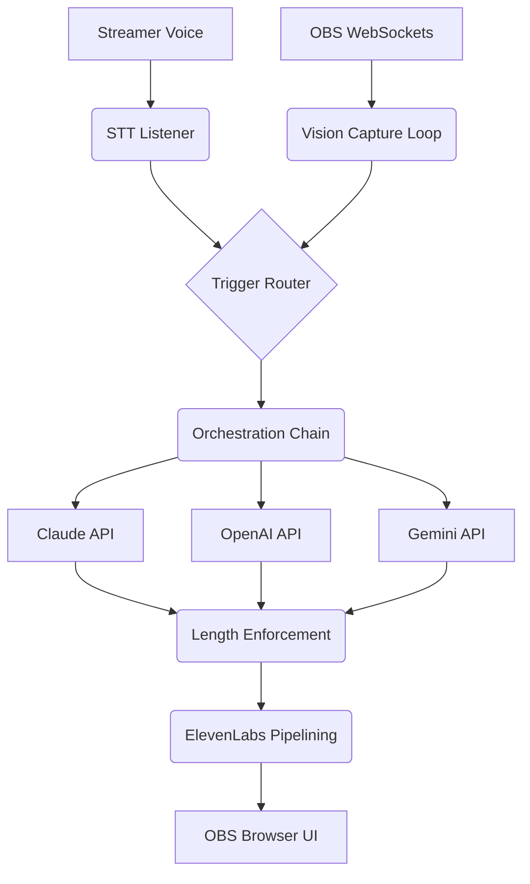

<div align="center">

# 🗡️ The Party Orchestrator
**A Next-Generation Multi-LLM Twitch Overlay System**

[](https://www.python.org/downloads/release/python-3100/)
[](https://obsproject.com/)
[](https://opensource.org/licenses/MIT)

*Built by Moonie ([WatchMoonie](https://twitch.tv/watchmoonie))*

</div>

---

## 🌟 The Vision

**The Party** is an experimental, production-grade AI co-presence system designed for live Twitch streams. It replaces traditional "reactive soundboards" with a living, breathing ensemble of five distinct AI companions. 

Each character is individually powered by a cutting-edge Large Language Model—representing a fusion of Anthropic, OpenAI, DeepSeek, Google, and xAI inside a single, synchronized conversational pipeline. They watch the stream, listen to the streamer, observe the gameplay, and dynamically interact with each other and the audience on-stream in pristine JRPG-style dialogue boxes.

---

## ✨ Core Features

* 🗣️ **Five-Model Ensemble Orchestration**: Seamlessly routes responses through a rotating cast of models (Claude Sonnet, GPT-4o, Gemini 2.5 Flash, DeepSeek, and Grok).
* 👁️ **Live Screen Reading**: Powered by GPT-4o Vision, a background async loop captures bursts of gameplay frames and maintains a running narrative of what is actively visible on the broadcast.
* 🎙️ **Real-Time Voice Interception**: Translates streamer speech instantly and routes triggers through a sophisticated rules engine to decide who speaks.
* ⚡ **Zero-Latency TTS Pipelining**: ElevenLabs voice generation occurs in concurrent, background worker threads. The system synthesises the *second* character's audio while the *first* character is actively speaking, perfectly eliminating inter-response latency.
* 🛡️ **AAA Context Compression**: Employs a robust static snapshot architecture. Historical game data and vision logs are efficiently compiled into the System Prompt instead of recursive message loops, dropping context token costs effectively to zero.
* 🎮 **JRPG-Style Visual Overlay**: Features a pixel-perfect OBS Browser Source overlay with auto-scrolling typewriter text formats bridging 887px exactly across Character portraits.

---

## ⚙️ Architecture

The orchestrator operates purely locally, connecting to **Streamer.bot** via UDP payloads and driving **OBS Studio** via websockets.



## 🚀 Quick Setup

1. **Clone & Install**
   ```bash
   git clone https://github.com/Moonie8t7/The_Party.git
   cd The_Party
   pip install -r requirements.txt
   ```

2. **Environment Variables**
   Copy `.env.example` to `.env` and fill out your API credentials (OpenAI, Anthropic, Gemini, Deepseek, Grok, ElevenLabs, Twitch, IGDB).

3. **OBS Configuration**
   Import `overlay/overlay.html` as a Browser Source in OBS (1920x1080).
   Ensure OBS WebSockets are enabled on port `4455`.

4. **Launch**
   ```bash
   python -m party.main
   ```

---
*© 2026 WatchMoonie. Built to push the boundary of AI stream interaction.*
